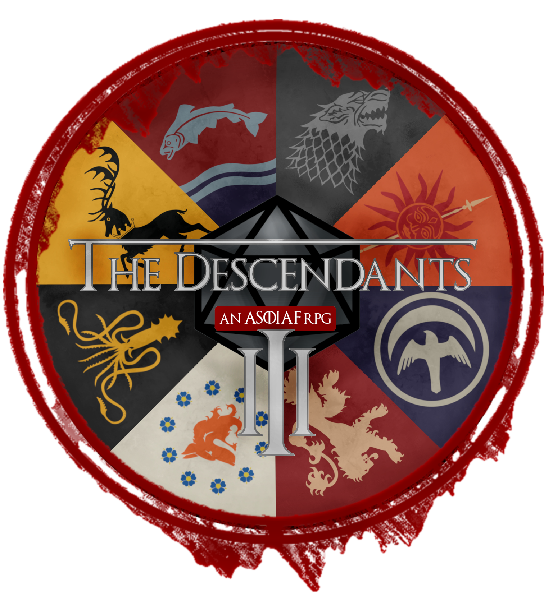

# Descendants III

[EL]: Descendants III (προ-άλφα έκδοση) - Παιχνίδι ρόλων εμπνευσμένο από την σειρά βιβλίων επικής φαντασίας *Το Τραγούδι της Φωτιάς και του Πάγου*.\

[EN]: Descendants III (pre-alpha version) - Roleplaying game inspired by the epic fantasy book series *A Song of Ice and Fire*

  

**English version below**

## Σχετικά με το παιχνίδι
Το Descendants είναι ένα Ελληνικό παιχνίδι ρόλων στο Facebook το οποίο δημιουργήθηκε τον Δεκέμρβιο του 2016 από αφοσιωμένους φανς του Game of Thrones. Έκτοτε, το παιχνίδι βρίσκεται σε συνεχή εξέλιξη. Το Descendants διαδραματίζεται στον φανταστικό κόσμο του *Τραγουδιού της Φωτιάς και του Πάγου* του G.R.R. Martin, μεταφέροντας τους παίκτες 100 χρόνια μετά τα γεγονότα του Winds of Winter. Όσο πλησιάζει η έκδοση alpha, θα δημοσιεύονται περισσότερες λεπτομέρεις για το παιχνίδι.

## Σχετικά με το repository
Η βάση δεδομένων του παιχνιδιού είναι αποθηκευμένη σε μια σειρά εγγράφων του Google Sheets, με τα οποία οι παίκτες αλληλεπιδρούν για να ασχοληθούν με θεμελιώδεις μηχανισμούς του παιχνιδιού, όπως π.χ. οικονομικές συναλλαγές, η διαχείριση των Οίκων τους, η διαχείριση των στατιστικών και των ιδιοτήτων των χαρακτήρων τους κ.λπ.\
Ο σκοπός του τρέχοντος εγχειρήματος είναι η ανάπτυξη μιας διαδικτυακής εφαρμογής με την χρήση του Google Apps Script, η οποία θα:
*   παρέχει μια σειρά αυτοματισμών που δεν ήταν εφικτοί στις προηγούμενες εκδόσεις του παιχνιδιού, όπου χρησιμοποιούνταν μόνο οι ενσωματωμένες λειτουργίες του Google Sheets,
*   προσφέρει ένα GUI με το οποίο οι παίκτες θα αλληλεπιδρούν, αντί να ασχολούνται άμεσα με τα έγγραφα των Google Sheets.

Αυτές οι αλλαγές προσδοκούν να προσφέρουν μια πιο φιλική προς τον χρήστη εμπειρία και να διευκολύνουν σημαντικά το έργο των Διοργανωτών (Game Masters).\
Προς το παρόν, το repository διαθέτει μόνο το πλαίσιο CSS του παιχνιδιού, καθώς είναι το πρώτο και μοναδικό στοιχείο που αναπτύσσεται αυτήν την στιγμή. Καθώς προχωρά η ανάπτυξη της εφαρμογής, θα γίνονται διαθέσιμα και τα υπόλοιπα αρχεία και κώδικες.

## Συμμετοχή και συνεισφορά
Προς το παρόν, το παιχνίδι παραμένει ανενεργό μέχρι να ολοκληρωθούν οι αρχικές δοκιμές της νέας έκδοσής του. Ωστόσο μπορείς να δηλώσεις ενδιαφέρον για συμμετοχή επικοινωνώντας με τους [διαχειριστές της ομάδας του παιχνιδιού στο Facebook](https://www.facebook.com/groups/478019717141911/members).\
Εάν είσαι εξοικειωμένος με JavaScript, HTML, ή/και CSS και θέλεις να συνεισφέρεις στην ανάπτυξη του παιχνιδιού, είσαι ευπρόσδεκτος να προτείνεις βελτιώσεις στο codebase, να προτείνεις νέα χαρακτηριστικά, ή να διορθώσεις bug που έχεις εντοπίσει.

## Άδειες
Το πλαίσιο CSS που χρησιμοποιείται σε αυτό το πρότζεκτ είναι μια τροποποιημένη έκδοση του [RPGUI (RPG gui για παιχνίδια Ιστού)](https://ronenness.github.io/RPGUI/), που διανέμεται με την άδεια zlib. Οι κύριες τροποποιήσεις που έγιναν ήταν η αφαίρεση του εφέ πιξελοποίησης από τα στοιχεία CSS, η αλλαγή γραμματοσειράς, και η αντικατάσταση των αρχικών εικόνων με εικόνες που σχεδιάστηκαν ειδικά για το Descendants 3.

---

## About the game
Descendants is a Greek roleplaying game on Facebook that was brought to life in December 2016 by devoted fans of Game of Thrones. Since its inception, the game is undergoing continuous evolution. Set within the fictional realm of G.R.R. Martin's *A Song of Ice and Fire*, Descendants transports players 100 years beyond the events of Winds of Winter. As the alpha version approaches, additional details about the game will be unveiled.

## About the repository
The game's database is stored in a number of Google Sheets documents, with which players interact in order to engange with fundamental game mechanics such as financial transations, the administration of their Houses, the management of their character's statistics and attributes, etc.\
The purpose of the current project is to develop a web application using Google Apps Script, which will:

*   provide a number of automations that were not possible in the previous versions of the game, where only the built-in functions of Google Sheets were utilised,
*   offer a GUI with which players will interact instead of directly engaging with Google Sheets documents.

These changes hope to offer a more user-friendly experience to players and ease significantly the work of the Organisers (Game Masters).\
At present, the repository holds only the game's foundational CSS framework, since it is the first and only component that is currently being developed. As the development of the app progresses, additional files and scripts will be introduced.

## Participation and contribution

Presently, the game remains inoperative until the alpha testing of the new version finalises. Nevertheless, you can request to participate by contacting the [administrators of the game's Facebook group](https://www.facebook.com/groups/478019717141911/members).\
If you are familiar with JavaScript, HTML, and/or CSS, and you wish to contribute to the development of the game, you are welcome to improve the codebase, suggest new feautures, or fix any bugs you encounter.

## Licenses
The CSS framework used in this project is a modified version of [RPGUI (RPG gui for web games)](https://ronenness.github.io/RPGUI/), distributed under the zlib license. The main modifications are the removal of the pixelation effect from CSS elements, the changing of fonts, and the substitution of the original images with custom images specifically designed for Descendants 3.
